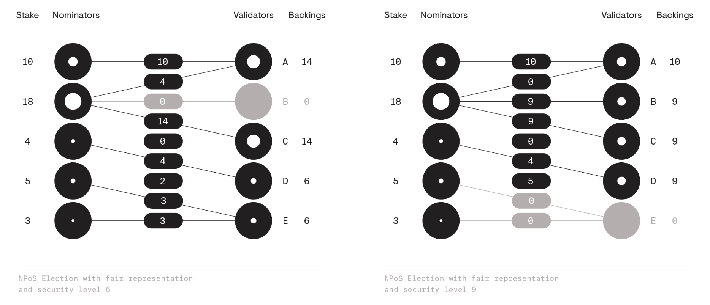

:::caution

The staking-miner code is experimental and it is still in development phase. Use is at your own discretion, as there is a risk of losing some funds.

:::

Staking miner is a passive validator functionality that runs when a new set of validators need to be elected for NPoS. This is a computationally intense process, hence the mining. Staking miners compete with each other to produce election solutions which consist of a validator set, stake distribution across that set, and a score indicating how optimal the solution is. Staking miners run the sequential Phragmén algortihm to produce results, and the result is then sent as a transaction to the relay chain via a normal signed extrinsic. The transaction requires a bond, and a transaction fee. The best solution is rewarded
which in the least covers the transaction fee, and the bond is returned to the account. If the solution is not valid, the bond and the fee are lost.

Staking miner uses a pallet called `pallet_election_provider_multi_phase` and can only produce solutions during the signed phase of the pallet's life cycle. Once the signed phase is over and the unsigned phase starts, only the off-chain workers can provide election results.


## NPoS election optimization

A basic election solution is a simple distribution of stake across validators, but this can be optimized for better distribution equaling a higher security score. The staking miner does not act as a validator and focuses solely on the election result and optimization of the solution. It connects to a specified chain and keeps listening to new signed phase of the election pallet in order to submit solutions to the NPoS election. When the correct time comes, it computes its solution and submits it to the chain. The default miner algorithm is sequential Phragmén with a configurable number of balancing iterations that improve the score.

Running the staking miner requires passing the seed of a funded account in order to pay the fees for the transactions that will be sent. The same account's balance is used to reserve deposits as well. The best solution in each round is rewarded. All correct solutions will get their bond back and the ones that submit invalid solutions will lose their bond.



## Signed Phase of the election pallet

The election provider pallet `pallet_election_provider_multi_phase` is divided into two phases, **signed** and **unsigned**. At the end of the pallet's timeline, the function `elect()` is called. 

```
                                                                   elect()
                +   <--T::SignedPhase-->  +  <--T::UnsignedPhase-->   +
  +-------------------------------------------------------------------+
   Phase::Off   +       Phase::Signed     +      Phase::Unsigned      +
```

Solutions provided by the staking miner can only be submitted during the signed phase. Solutions are submitted and queued on the chain as a `RawSolution`. Once submitted, a solution cannot be retracted by the orinating account.

`RawSolution` struct definition:
```
pub struct RawSolution<S> {
    pub solution: S, // The solution itself
    pub score: ElectionScore, // The claimed score of the solution.
    pub round: u32, // The round at which this solution should be submitted.
}
```
A maximum of `pallet::Config::MaxSignedSubmissions` will be stored on-chain and they will be sorted based on score. Higher the score the more optimal the election solution is. 

Upon arrival of a new solution:

1. If the queue is not full, it is stored in the appropriate sorted index.
2. If the queue is full but the submitted solution is better than one of the queued ones, the worse solution is discarded, the bond of the outgoing solution is returned, and the new solution is stored in the correct index.
3. If the queue is full and the solution is not an improvement compared to any of the queued ones, it is instantly rejected and no additional bond is reserved.

Upon the end of the signed phase, no more solutions can be submitted and the solutions in the queue will be checked using `Pallet::feasibility_check` which ensures the score is indeed correct, and marks them as valid or invalid. By checking each solution in the queue, the queue will be reorganized by score. The highest valid score will be rewarded. Invalid solutions with higher score than the winning solution will be slashed. The rest of the solutions will be discarded and their deposit will be returned.

```
Queue
+-------------------------------+
|Solution(score=20, valid=false)| +-->  Slashed
+-------------------------------+
|Solution(score=15, valid=true )| +-->  Rewarded, Saved
+-------------------------------+
|Solution(score=10, valid=true )| +-->  Discarded
+-------------------------------+
|Solution(score=05, valid=false)| +-->  Discarded
+-------------------------------+
|             None              |
+-------------------------------+
```

If you want to run a staking miner on your validator, refer to the repository provided in the resources section below.

## Further Resources

- [Election Pallet definition](https://crates.parity.io/pallet_election_provider_multi_phase/index.html)
- [Staking Miner repository](https://github.com/paritytech/polkadot/tree/master/utils/staking-miner)